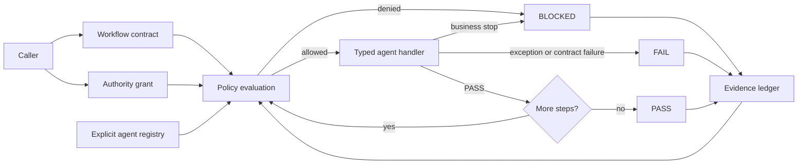

# Governed Agent Runtime

[](https://github.com/DameurMounir/governed-agent-runtime/actions/workflows/ci.yml)
[](https://www.python.org/)
[](LICENSE)
[](pyproject.toml)

**Governed orchestration runtime for evidence-bound multi-agent workflows.**

`governed-agent-runtime` is a typed Python reference runtime that separates agent
orchestration from execution authority. A workflow step runs only after the runtime
validates the caller's grant, subject, workflow scope, expiry, capability, effect class,
evidence prerequisites, and registered agent identity.

Every terminal path is explicit:

- `PASS` means the authorized work completed;
- `BLOCKED` means the runtime stopped safely before an unmet condition could be bypassed;
- `FAIL` means an attempted execution or contract failed.

The foundation is deliberately small, deterministic, auditable, and fail-closed. It is a
control substrate for later LangChain, LangGraph, Deep Agents, tool, model, storage, and
observability adapters—not a wrapper that grants those integrations implicit authority.

> **Status:** foundation `v0.1.0`. This repository proves the governance core and walking
> slices. It does not claim distributed or production deployment readiness.

## Why this exists

Agent frameworks are good at deciding **what should run next**. Production systems must
also answer harder questions:

1. Who authorized this workflow?
2. Which capabilities were granted, to which subject, for which workflow, and until when?
3. Which evidence had to exist before a step could execute?
4. What external effect could the step produce?
5. Did the system stop safely, or did an attempted execution fail?
6. Can a reviewer reconstruct the decision path afterward?

This project turns those questions into executable contracts and testable invariants.

## Decision semantics

| Decision | Meaning | Runtime behavior | CLI exit code |
| --- | --- | --- | ---: |
| `PASS` | Every governed step completed successfully. | Continue until the workflow is complete. | `0` |
| `BLOCKED` | Authority, evidence, policy, dependency, or an agent-level business condition was not satisfied. | Stop safely; do not execute later steps. | `3` |
| `FAIL` | An attempted execution or contract failed unexpectedly. | Stop immediately and append failure evidence. | `4` |

`BLOCKED` is deliberately not collapsed into `FAIL`. A safe refusal is an expected governed
outcome and must remain distinguishable from an execution failure.

## Architecture



The runtime does not discover plugins dynamically, invoke models, deploy services, or grant
itself authority. Integrators register explicit handlers behind typed descriptors, and the
runtime remains the policy-enforcing boundary.

## Core invariants

| Invariant | Enforcement |
| --- | --- |
| No matching authority means no execution. | Subject, workflow identity, and expiry are evaluated before any handler runs. |
| A capability must be granted and declared. | Both the authority grant and registered agent descriptor are checked. |
| Higher-risk effects require explicit permission. | `READ_ONLY`, `REVERSIBLE`, and `IRREVERSIBLE` are separate effect classes. |
| Missing evidence fails closed. | Required evidence kinds are evaluated before each step. |
| Unknown agents do not execute. | The registry must resolve every agent before authority consumption. |
| A non-`PASS` result terminates sequencing. | No later workflow step runs after `BLOCKED` or `FAIL`. |
| Single-use grants cannot replay in one runtime process. | The authority-use registry records consumed authorization IDs. |
| Evidence is deterministic and linked. | Canonical JSON and SHA-256 chaining detect mutation and ordering changes. |
| Exceptions do not leak arbitrary messages. | Runtime evidence records the exception type and a controlled summary. |

## Core guarantees in v0.1.0

- Immutable typed models for workflows, steps, authority grants, agents, outcomes, evidence,
  and terminal results.
- Workflow-bound, subject-bound, time-bound capability grants.
- Optional single-use authority replay protection within one process.
- Policy checks for capability, effect class, and required evidence.
- Explicit agent registration with no dynamic discovery.
- Sequential stop-on-non-`PASS` orchestration.
- Canonical JSON and SHA-256 evidence chaining.
- JSON Schema contracts for workflow and authority inputs.
- Deterministic `PASS`, `BLOCKED`, and `FAIL` walking slices.
- Dependency-free runtime package; verification tools remain development-only.
- Python 3.12 and 3.13 continuous integration.

## Quick start

```bash
python3 -m venv .venv
. .venv/bin/activate
python -m pip install -r requirements-ci.txt -e .
make verify
```

Run the deterministic walking slices:

```bash
gar demo pass

gar demo blocked   # exits 3 by design

gar demo fail      # exits 4 by design
```

Persist evidence for a walking slice:

```bash
gar demo pass --evidence-out artifacts/pass-evidence.json
```

## Execute JSON contracts

The repository includes one valid authority grant and one valid workflow contract:

```bash
gar run \
  --workflow examples/pass-workflow.json \
  --authority examples/pass-authority.json \
  --evidence-out artifacts/evidence.json
```

The CLI writes the terminal result to standard output and, when requested, writes the full
ordered evidence chain to the selected path.

## Use as a Python library

```python
from governed_agent_runtime import (
    AgentDescriptor,
    AgentRegistry,
    AuthorityGrant,
    GovernedRuntime,
    StepSpec,
    WorkflowSpec,
)

registry = AgentRegistry()
# Register reviewed handlers behind explicit AgentDescriptor contracts.
runtime = GovernedRuntime(subject="governed-runtime", registry=registry)

# Construct WorkflowSpec and AuthorityGrant instances, then execute:
# result = runtime.execute(workflow, authority)
```

The package is marked as typed through `py.typed`, and strict mypy validation is part of the
repository gate suite.

## Repository map

```text
.
├── src/governed_agent_runtime/   # Contracts, policy, registry, runtime, evidence, and CLI
├── tests/                        # Positive, negative, boundary, replay, and failure tests
├── examples/                     # Executable workflow and authority JSON contracts
├── docs/
│   ├── architecture.md           # Components, sequence, trust boundaries, extension points
│   ├── threat-model.md           # Assets, threats, controls, residual risks
│   ├── verification.md           # Local and CI evidence requirements
│   ├── roadmap.md                # Governed implementation sequence and branch plan
│   ├── contracts/                # JSON Schema definitions
│   ├── decisions/                # Architecture decision records
│   └── status/                   # Evidence-based implementation status
├── scripts/check_repository.py   # Repository hygiene and contract checks
├── .github/workflows/ci.yml      # Python 3.12/3.13 quality and safety gates
├── GOVERNANCE.md                 # Change authority and evidence expectations
├── SECURITY.md                   # Security model and private reporting guidance
├── CONTRIBUTING.md               # Review and verification workflow
└── CHANGELOG.md                  # Versioned change record
```

## Verification

The same behavioral foundation is checked locally and on GitHub Actions.

| Gate | Required evidence |
| --- | --- |
| Repository hygiene | Required files, JSON Schema metadata, LF endings, final newlines, and no generated artifacts |
| Ruff | Full lint and formatter compliance |
| mypy | Strict type checking with unreachable-code warnings |
| pytest | All tests pass on Python 3.12 and 3.13 |
| Branch coverage | At least 95 percent |
| Bandit | No accepted source finding hidden by default skips |
| detect-secrets | No detected secret candidate in tracked files |
| pip-audit | No known vulnerability in the pinned verification requirements |
| Packaging | Source distribution and wheel build successfully |
| Walking slices | `PASS`, `BLOCKED`, and `FAIL` produce their exact terminal semantics and exit codes |

The foundation contains 69 tests. See [verification](docs/verification.md) for the complete
gate contract and expected evidence.

## Governed roadmap

The implementation roadmap keeps framework adapters behind the governance core:

1. durable authority consumption and durable evidence persistence;
2. LangGraph checkpoint and resume adapter with policy re-evaluation;
3. LangChain tool adapters with capability and effect declarations;
4. Deep Agents supervision and delegation constrained by explicit authority;
5. observability, replay, evaluation, and adversarial recovery evidence;
6. deployment hardening only after durable state and integration gates pass.

No roadmap item is represented as implemented before its branch, tests, threat analysis, and
walking slice are accepted. See [roadmap](docs/roadmap.md).

## Boundaries

This foundation is an in-process reference runtime. It does **not** yet provide:

- durable or distributed authority consumption;
- database-backed evidence storage;
- cryptographic grant or evidence signatures;
- remote A2A, MCP, queue, scheduler, or model-provider execution;
- LangChain, LangGraph, or Deep Agents runtime dependencies;
- multi-tenant isolation, deployment automation, production SLOs, or incident operations.

Those are visible integration boundaries rather than hidden assumptions.

## Documentation index

- [Architecture](docs/architecture.md)
- [Threat model](docs/threat-model.md)
- [Verification contract](docs/verification.md)
- [Implementation roadmap](docs/roadmap.md)
- [Architecture decision record](docs/decisions/0001-evidence-bound-runtime.md)
- [Foundation status](docs/status/foundation-v0.1.0.md)
- [Governance](GOVERNANCE.md)
- [Security policy](SECURITY.md)
- [Contributing](CONTRIBUTING.md)
- [Support](SUPPORT.md)
- [Changelog](CHANGELOG.md)

## Security and governance

Changes must preserve the fail-closed direction and include evidence for any authority,
capability, effect, sequencing, or trust-boundary change. Review
[CONTRIBUTING.md](CONTRIBUTING.md) and [GOVERNANCE.md](GOVERNANCE.md) before opening a pull
request.

Report security concerns through the private process described in [SECURITY.md](SECURITY.md).
The project is licensed under the [Apache License 2.0](LICENSE).
