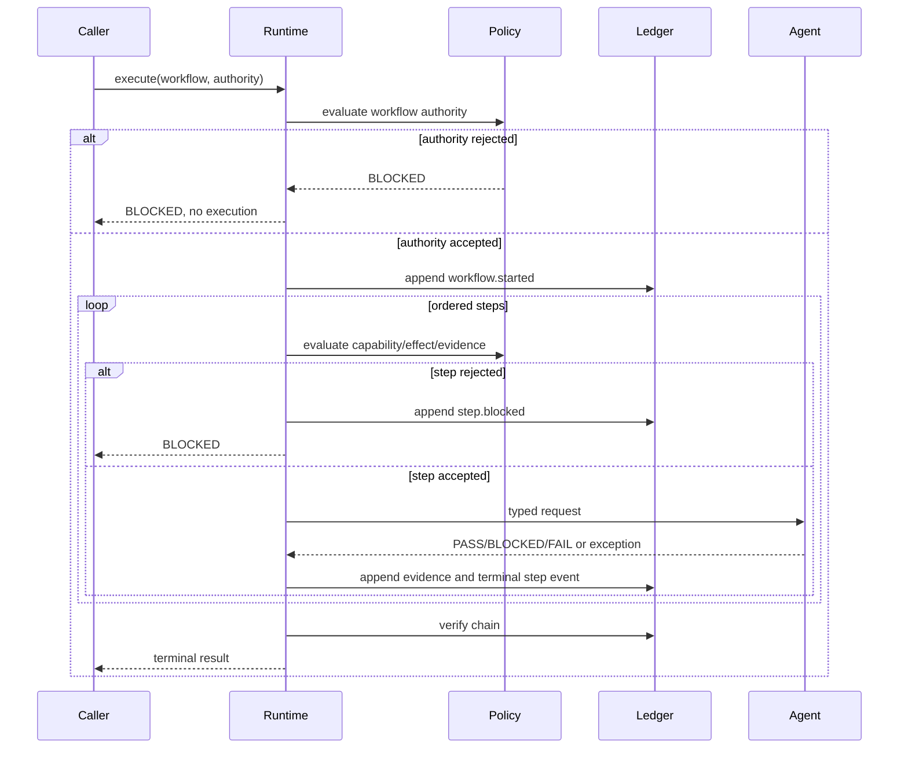
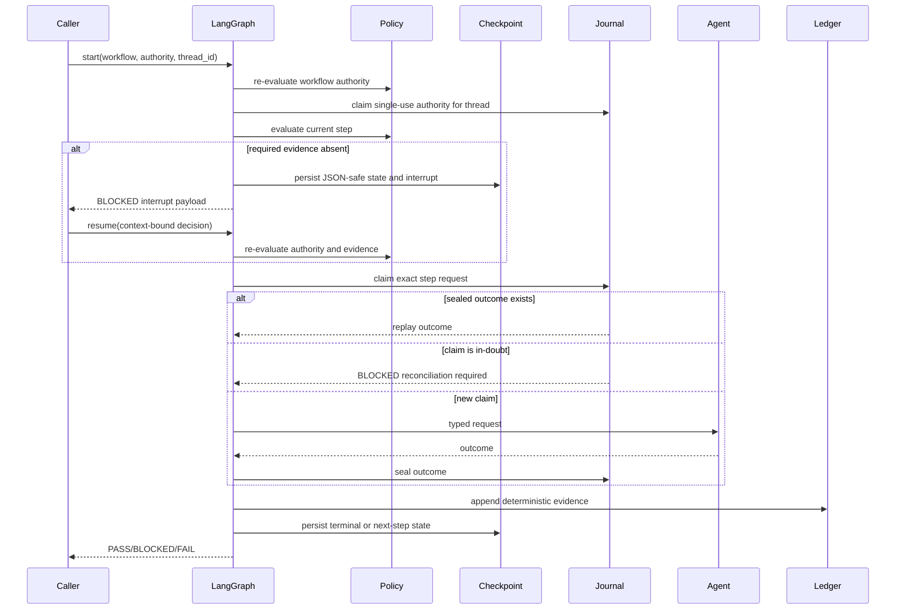

# Architecture

## Components

1. **Contracts** define workflow, authority, step, agent, outcome, result, and resume data.
2. **Agent registry** binds a stable agent identity to a typed in-process handler.
3. **Runtime policy** decides whether workflow and step prerequisites permit execution.
4. **Governed runtime** executes sequentially and stops on the first non-`PASS` result.
5. **Evidence ledger** records canonical, hash-linked evidence.
6. **Serialization boundary** converts external JSON into validated contracts.
7. **LangGraph adapter** owns graph sequencing, checkpointing, interruption, and resume without
   becoming a source of authority.
8. **Execution journal** durably binds single-use authority to a graph thread and records step
   execution claims and sealed outcomes.

## Core execution sequence

## LangGraph persistent sequence

## Trust boundaries

- External JSON is untrusted until parsed into validated contracts.
- Resume JSON is untrusted until its thread, workflow, step, decision, and evidence are validated.
- Agent handlers are trusted only for their declared capability; runtime policy remains
  authoritative.
- LangGraph controls routing and persistence, not permission.
- Checkpoint bytes are integrity-sensitive and are deserialized with strict module allowlists and
  no pickle fallback.
- SQLite checkpoint and journal files must be private regular files beneath private directories.
- Evidence payloads are serialized deterministically, but SHA-256 chaining alone does not provide
  signer identity or external anchoring.
- The foundation `AuthorityUseRegistry` protects against replay only inside one process. The
  candidate SQLite journal proves same-host persistence, not a distributed authority service.

## Extension points

Integrators can supply:

- a different `Clock`;
- a production transactional authority and execution journal;
- an alternative policy implementation;
- agent adapters registered behind `AgentHandler`;
- durable evidence persistence and external integrity anchoring;
- a production checkpointer with tenant isolation, encryption, backup, and migration controls.

Extension must preserve stop-on-non-`PASS` behavior unless an explicit, reviewed contract changes
it.
