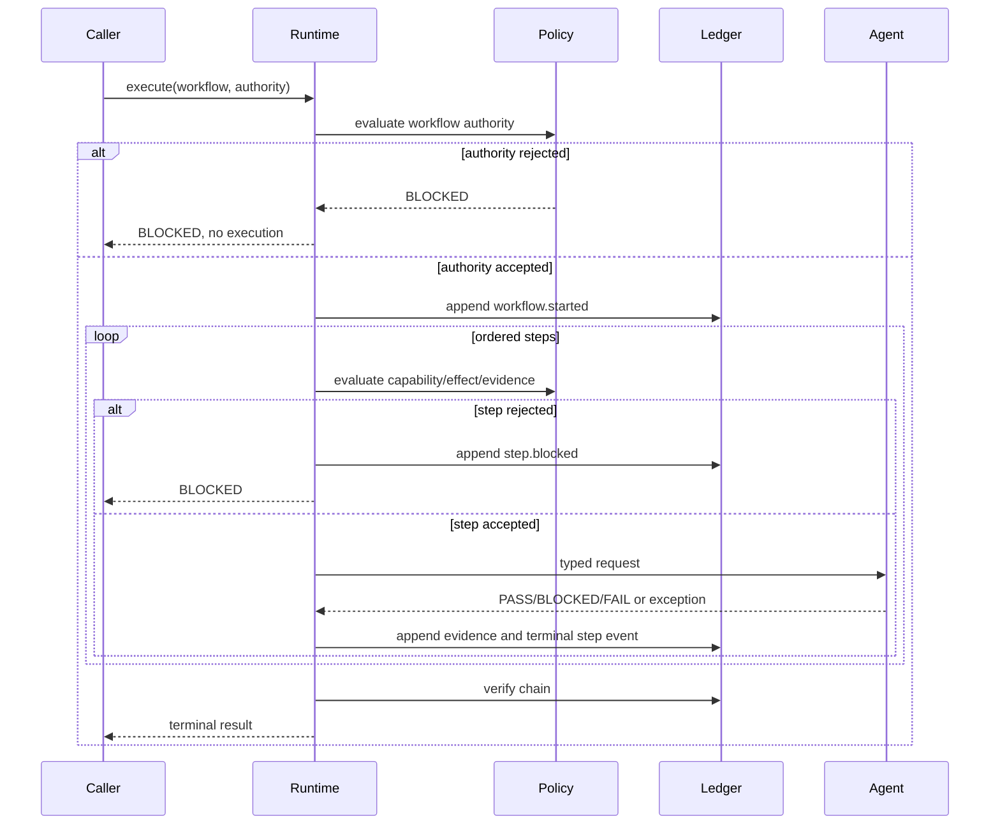

# Architecture

## Components

1. **Contracts** define workflow, authority, step, agent, outcome, and result data.
2. **Agent registry** binds a stable agent identity to a typed in-process handler.
3. **Runtime policy** decides whether workflow and step prerequisites permit execution.
4. **Governed runtime** executes sequentially and stops on the first non-PASS result.
5. **Evidence ledger** records canonical, hash-linked evidence.
6. **Serialization boundary** converts external JSON into validated contracts.

## Execution sequence

## Trust boundaries

- External JSON is untrusted until parsed into validated contracts.
- Agent handlers are trusted only for their declared capability; runtime policy remains authoritative.
- Evidence payloads are serialized deterministically, but SHA-256 chaining alone does not provide signer identity or durable storage.
- `AuthorityUseRegistry` protects against replay only inside one process. Distributed use requires a transactional durable authority service.

## Extension points

Integrators can supply:

- a different `Clock`;
- a durable authority-use registry;
- an alternative policy implementation;
- agent adapters registered behind `AgentHandler`;
- durable evidence persistence after each append.

Extension must preserve stop-on-non-PASS behavior unless an explicit, reviewed contract changes it.
