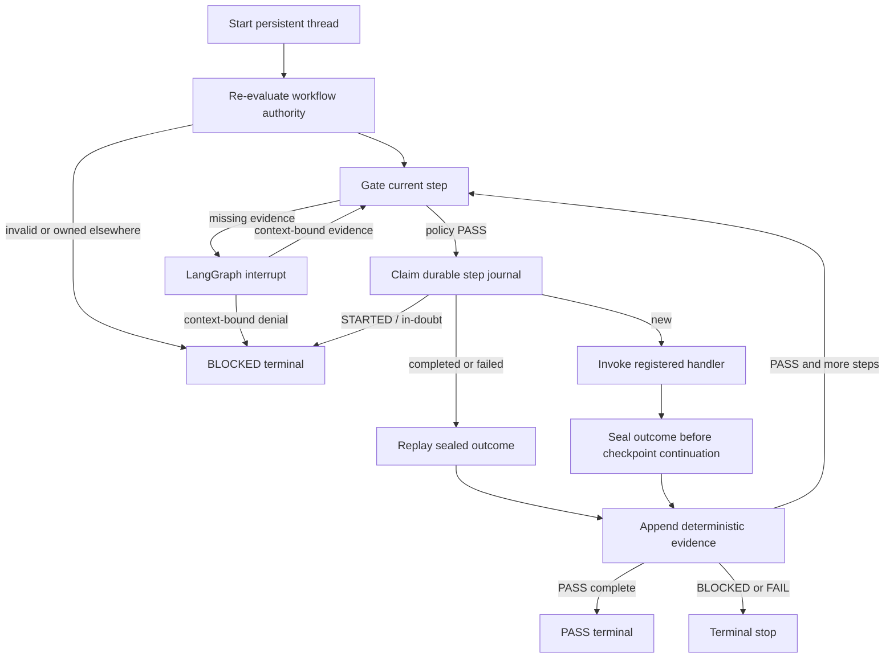

# Governed LangGraph execution

## Purpose

This adapter proves persistent graph orchestration without allowing the framework to become a
source of authority. LangGraph selects the next node; the governed runtime decides whether that
node may execute.



## Security invariants

1. `thread_id` is mandatory and identifies one checkpoint history.
2. The single-use authority grant is durably bound to the first workflow thread that consumes it.
3. Resuming the same thread is idempotent; a second thread cannot reuse the grant.
4. Every resume contract is bound to the active `thread_id`, `workflow_id`, and `step_id`.
5. The complete step request and pre-step evidence head are SHA-256 bound in the journal.
6. A completed journal outcome is replayed; its handler is not invoked again.
7. An unfinished `STARTED` claim is in-doubt and blocks automatic re-execution.
8. Checkpoint state contains JSON-safe builtins only and uses strict deserialization settings.
9. Human resume evidence must match a currently missing evidence kind.
10. No external handler executes before an evidence interrupt is satisfied.
11. Every non-`PASS` decision stops downstream execution.

## Pinned integration boundary

The candidate branch pins the direct framework packages used by its CI and wheel smoke tests:

- `langgraph==1.2.10`;
- `langgraph-checkpoint==4.2.0`;
- `langgraph-checkpoint-sqlite==3.1.1`.

Checkpoint deserialization is hardened in two independent ways:

```text
LANGGRAPH_STRICT_MSGPACK=true
JsonPlusSerializer(
    pickle_fallback=False,
    allowed_json_modules=None,
    allowed_msgpack_modules=None,
)
```

The exact security rationale and advisory floors are recorded in
[the security baseline](research/langgraph-security-baseline.md).

## Deterministic walking slices

```bash
gar-langgraph demo pass
gar-langgraph demo blocked       # exits 3 after an interrupt
gar-langgraph demo resume
gar-langgraph demo fail          # exits 4 with controlled failure evidence
```

## Persistent example

Create a private runtime directory first. The adapter rejects group/world-accessible database
parents and rejects symbolic-link, special-file, or group/world-accessible database targets.

```bash
install -d -m 700 .runtime
export LANGGRAPH_STRICT_MSGPACK=true

gar-langgraph start \
  --thread-id langgraph-example-thread-001 \
  --checkpoint-db .runtime/checkpoints.sqlite \
  --journal-db .runtime/journal.sqlite \
  --workflow examples/langgraph-workflow.json \
  --authority examples/langgraph-authority.json

# The start command exits 3 because human.approval is absent.
gar-langgraph resume \
  --thread-id langgraph-example-thread-001 \
  --checkpoint-db .runtime/checkpoints.sqlite \
  --journal-db .runtime/journal.sqlite \
  --resume-contract examples/langgraph-resume.json

gar-langgraph inspect \
  --thread-id langgraph-example-thread-001 \
  --checkpoint-db .runtime/checkpoints.sqlite \
  --journal-db .runtime/journal.sqlite
```

The resume contract is not a free-form approval. It names the exact thread, workflow, and step
reported by the active interrupt. A mismatch is rejected before `Command(resume=...)` is invoked.

## Recovery semantics

LangGraph resumes an interrupted node from its beginning. This adapter deliberately performs no
external handler call before `interrupt()`. For the execution node, the durable journal creates
three meaningful cases:

- `NEW`: run the handler once and then seal its outcome;
- `COMPLETED`/`FAILED`: return the stored outcome without rerunning the handler;
- `IN_DOUBT`: stop as `BLOCKED` because the process may have failed after a side effect but before
  the terminal journal update.

The in-doubt state is safer than blind retry, but it is not automatic compensation. Production
irreversible effects require a later transactional outbox, provider idempotency key, or explicit
human reconciliation workflow.

## Compatibility boundary

Node names, state fields, checkpoint schema version, and resume-contract identifiers are
compatibility surfaces. Renaming them while paused threads exist requires a migration. The branch
keeps the original core package and `gar` CLI usable without importing LangGraph; the integration
is installed through the `langgraph` optional extra.

## Operational boundary

`SqliteSaver` is used only for the synchronous, local walking slice and small-project evidence. The
adapter does not represent SQLite as a multi-process, horizontally scalable, multi-tenant, or
production authority service. Backups, encryption at rest, credential separation, retention,
external integrity anchoring, and disaster recovery remain operator responsibilities.
